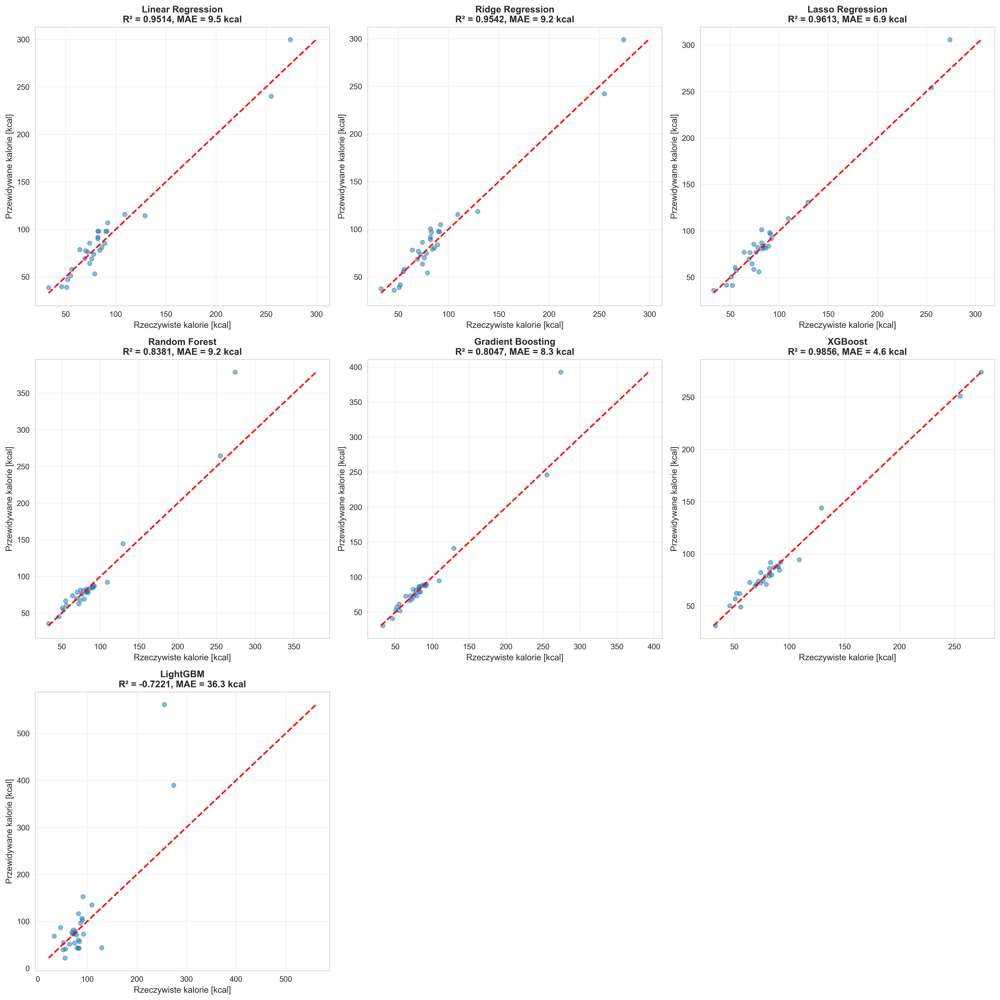
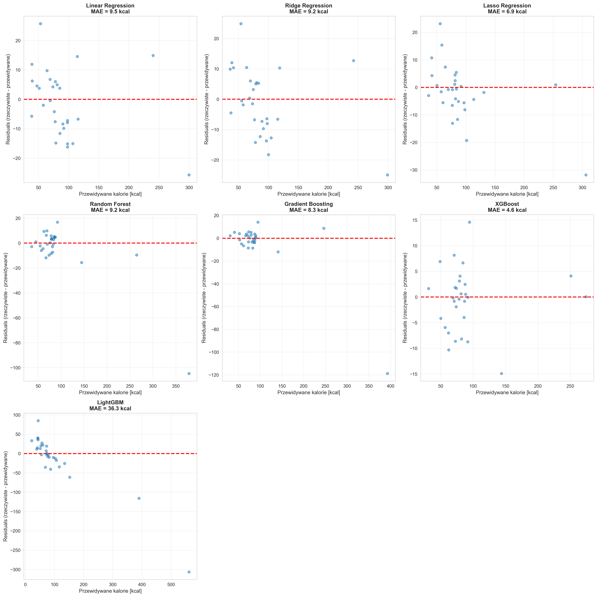
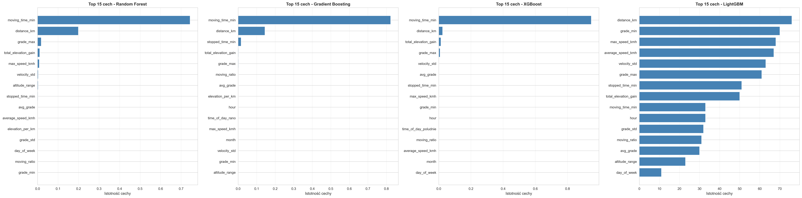
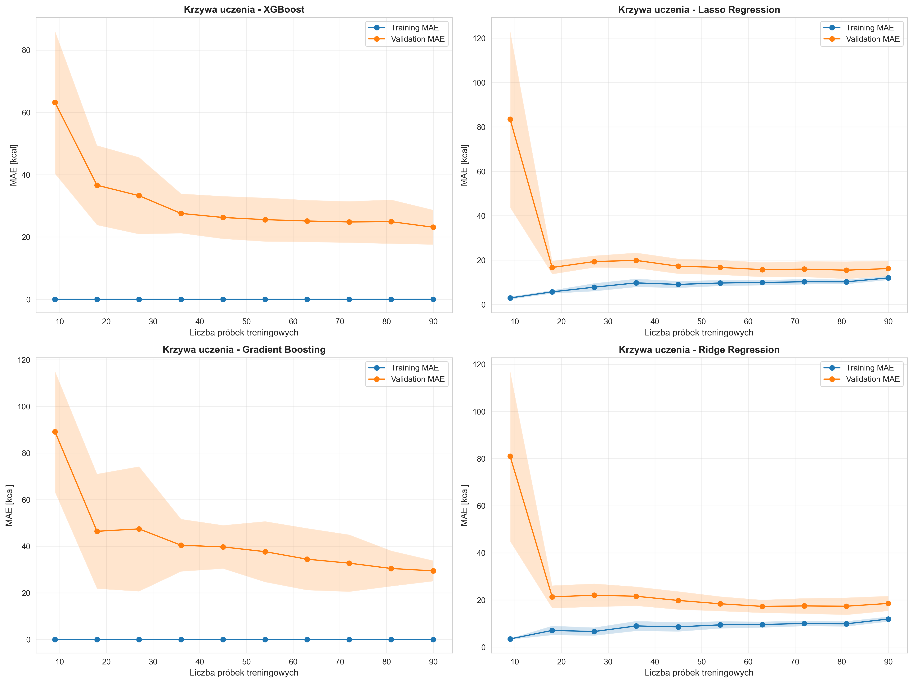
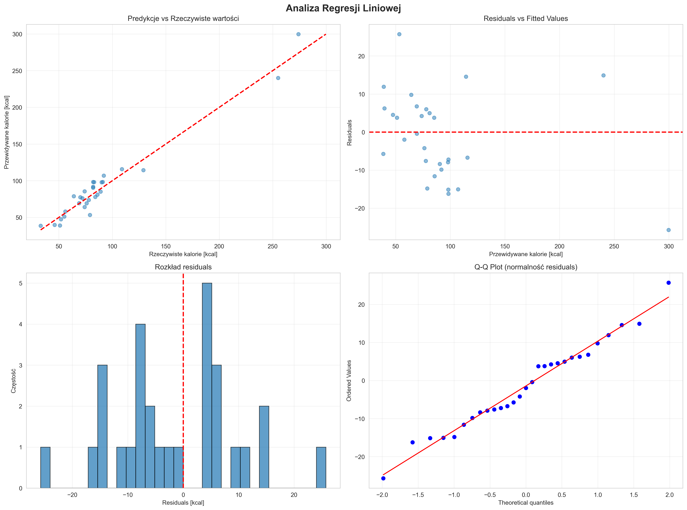
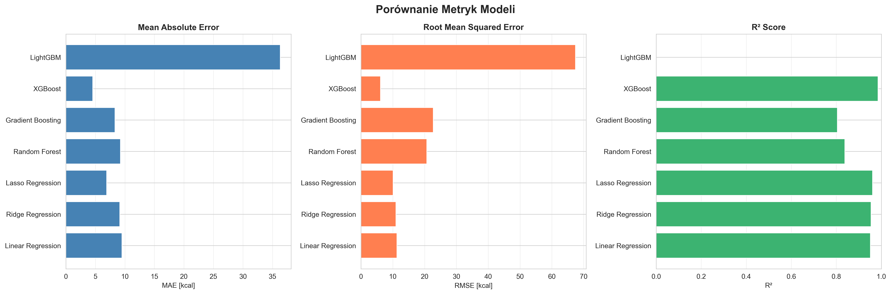

# Cycling Calories ML

**Calorie Expenditure Prediction for Cyclists Using Machine Learning**

Bachelor's Thesis - Łukasz Ryczko (14621)
University of Economics and Computer Science in Krakow

---

## Table of Contents

- [Project Overview](#project-overview)
- [Features](#features)
- [System Architecture](#system-architecture)
- [Prerequisites](#prerequisites)
- [Installation](#installation)
- [Strava API Configuration](#strava-api-configuration)
- [Usage](#usage)
- [Machine Learning Pipeline](#machine-learning-pipeline)
- [GPX-based Prediction](#gpx-based-prediction)
- [Data Visualization](#data-visualization)
- [Model Performance](#model-performance)
- [Project Structure](#project-structure)
- [Troubleshooting](#troubleshooting)
- [References](#references)

---

## Project Overview

This system provides a comprehensive solution for collecting, processing, and analyzing cycling training data from Strava, with advanced machine learning models for predicting calorie expenditure. The project implements multiple regression algorithms and comparative analysis tools suitable for academic research and practical applications.

### Key Objectives

- Automated data collection from Strava API
- Advanced feature engineering for cycling metrics
- Comparative analysis of machine learning algorithms
- Visualization suite for academic publication
- GPX file analysis and calorie prediction
- Route-based speed and energy expenditure forecasting

### Technical Approach

The system employs supervised learning techniques with extensive feature extraction from GPS, elevation, heart rate, and power data. Multiple regression models are trained and evaluated to identify optimal prediction accuracy for calorie expenditure based on route characteristics and rider attributes.

---

## Features

### 1. Data Acquisition

- Automated retrieval of cycling activities via Strava API
- Stream data collection (GPS coordinates, elevation, heart rate, cadence, power)
- Comprehensive athlete profile integration
- Batch processing with rate limiting

### 2. Data Processing

- Feature extraction from raw GPS and sensor data
- Derived metrics calculation (grade, speed variations, elevation gain)
- Outlier detection and removal
- Missing value imputation
- Temporal feature engineering

### 3. Visualization Suite

The system generates publication-ready visualizations:

**Data Analysis Visualizations** (`data/visualizations/`):
- Heatmap: Distance vs Elevation vs Calories
- Heatmap: Speed vs Duration vs Calories
- Heatmap: Distance vs Speed vs Calories
- Correlation matrix of training variables
- Distribution plots for key metrics
- Scatter plots showing feature relationships
- Time series analysis of training progression

**Machine Learning Visualizations** (`data/ml_visualizations/`):
- Model prediction comparison (actual vs predicted)
- Residual analysis plots
- Feature importance rankings
- Learning curves for model optimization
- Linear regression diagnostic plots (Q-Q plot, residual distribution)
- Comparative metrics visualization

### 4. Machine Learning Pipeline

- Train/test split with stratification (80/20)
- Feature scaling using StandardScaler
- Multiple algorithm implementation:
  - Linear Regression (baseline)
  - Ridge Regression
  - Lasso Regression
  - Random Forest Regressor
  - Gradient Boosting Regressor
  - XGBoost (optional)
  - LightGBM (optional)
- Cross-validation for model stability
- Comprehensive performance metrics (MAE, RMSE, R², MAPE)

### 5. GPX Analysis and Prediction

- Route parsing from standard GPX format
- Speed prediction along route segments
- Calorie expenditure estimation
- Visual route analysis with speed overlays
- Elevation profile generation
- Detailed prediction reports

---

## System Architecture

```
┌─────────────────────────────────────────────────────────────────┐
│                        Strava API                                │
└───────────────────────────────┬─────────────────────────────────┘
                                │
                                ▼
                    ┌─────────────────────┐
                    │  Data Collection    │
                    │  (strava_client.py) │
                    └──────────┬──────────┘
                               │
                               ▼
                    ┌─────────────────────┐
                    │  Data Processing    │
                    │ (data_processor.py) │
                    └──────────┬──────────┘
                               │
                ┌──────────────┴──────────────┐
                ▼                             ▼
    ┌─────────────────────┐      ┌─────────────────────┐
    │   Visualization     │      │  ML Preparation     │
    │ (visualization.py)  │      │(ml_preparation.py)  │
    └─────────────────────┘      └──────────┬──────────┘
                                            │
                                            ▼
                                ┌─────────────────────┐
                                │  Model Training     │
                                │ (train_models.py)   │
                                └──────────┬──────────┘
                                           │
                                           ▼
                                ┌─────────────────────┐
                                │  GPX Prediction     │
                                │(predict_from_gpx.py)│
                                └─────────────────────┘
```

---

## Prerequisites

- Python 3.8 or higher
- Active Strava account with cycling activities
- Strava API credentials (Client ID, Client Secret, Access Token)
- Minimum 30-50 cycling activities for model training

---

## Installation

### Step 1: Clone or Download Repository

```bash
cd cycling_calories_ml
```

### Step 2: Create Virtual Environment (Recommended)

```bash
# macOS/Linux
python3 -m venv venv
source venv/bin/activate

# Windows
python -m venv venv
venv\Scripts\activate
```

### Step 3: Install Dependencies

```bash
pip install -r requirements.txt
```

Required packages:
- pandas >= 2.0.0
- numpy >= 1.24.0
- matplotlib >= 3.7.0
- seaborn >= 0.12.0
- scikit-learn >= 1.3.0
- scipy >= 1.11.0
- requests >= 2.31.0
- PyYAML >= 6.0
- xgboost >= 2.0.0 (optional)
- lightgbm >= 4.0.0 (optional)

---

## Strava API Configuration

### Step 1: Create Strava Application

1. Navigate to https://www.strava.com/settings/api
2. Click "Create an App"
3. Complete the application form:
   - Application Name: `Cycling Calories ML`
   - Category: `Data Importer` or `Research`
   - Website: `http://localhost`
   - Authorization Callback Domain: `localhost`
4. Record your Client ID and Client Secret

### Step 2: Generate Access Token

#### Method A: Browser-based Authentication

1. Open the following URL in your browser (replace YOUR_CLIENT_ID):

```
https://www.strava.com/oauth/authorize?client_id=YOUR_CLIENT_ID&response_type=code&redirect_uri=http://localhost&approval_prompt=force&scope=activity:read_all
```

2. Authorize the application
3. Copy the authorization code from the redirect URL
4. Exchange code for access token:

```bash
curl -X POST https://www.strava.com/oauth/token \
  -d client_id=YOUR_CLIENT_ID \
  -d client_secret=YOUR_CLIENT_SECRET \
  -d code=YOUR_AUTHORIZATION_CODE \
  -d grant_type=authorization_code
```

5. Record the access_token and refresh_token from the response

### Step 3: Configure Application

```bash
cp config/config.example.yaml config/config.yaml
```

Edit `config/config.yaml` with your credentials:

```yaml
strava:
  access_token: "YOUR_ACCESS_TOKEN"
  client_id: "YOUR_CLIENT_ID"
  client_secret: "YOUR_CLIENT_SECRET"
  refresh_token: "YOUR_REFRESH_TOKEN"
```

**Note:** The config.yaml file is excluded from version control for security.

---

## Usage

### Full Pipeline Execution

Execute the complete data processing and model training pipeline:

```bash
python main.py --all
```

This runs all five stages:
1. Data collection from Strava API
2. Data processing and feature engineering
3. Visualization generation
4. ML dataset preparation (train/test split)
5. Model training and evaluation

### Individual Stage Execution

Run specific pipeline stages:

```bash
# Stage 1: Data collection
python main.py --step 1

# Stage 2: Data processing
python main.py --step 2

# Stage 3: Visualization generation
python main.py --step 3

# Stage 4: ML dataset preparation
python main.py --step 4

# Stage 5: Model training
python main.py --step 5
```

### Direct Module Execution

```bash
# Data collection
python -m src.strava_client

# Data processing
python -m src.data_processor

# Visualization
python -m src.visualization

# ML preparation
python -m src.ml_preparation

# Model training
python -m src.train_models
```

---

## Machine Learning Pipeline

### Model Training

After data preparation (Step 4), train all models:

```bash
python main.py --step 5
```

### Trained Models

The system trains and compares seven regression algorithms:

1. **Linear Regression** - Baseline model, ordinary least squares
2. **Ridge Regression** - L2 regularization
3. **Lasso Regression** - L1 regularization, feature selection
4. **Random Forest** - Ensemble method, typically best performance
5. **Gradient Boosting** - Sequential ensemble learning
6. **XGBoost** - Optimized gradient boosting (if installed)
7. **LightGBM** - Fast gradient boosting (if installed)

### Performance Metrics

Models are evaluated using:

- **MAE (Mean Absolute Error)**: Average prediction error in kcal
- **RMSE (Root Mean Squared Error)**: Penalizes larger errors
- **R² (R-squared)**: Proportion of variance explained (0-1)
- **MAPE (Mean Absolute Percentage Error)**: Percentage error
- **5-Fold Cross-Validation**: Model stability assessment

### Model Output

**Saved Models** (`data/ml_models/`):
- `random_forest.pkl` - Random Forest model (typically best)
- `xgboost.pkl` - XGBoost model
- `linear_regression.pkl` - Linear regression baseline
- Additional model files for each algorithm
- `model_comparison.txt` - Performance comparison table

**Visualizations** (`data/ml_visualizations/`):
- `01_predictions_comparison.png` - Model predictions vs actual values
- `02_residuals_plot.png` - Residual analysis
- `03_feature_importance.png` - Feature importance rankings
- `04_learning_curves.png` - Training progression curves
- `05_linear_regression_analysis.png` - Regression diagnostics
- `06_metrics_comparison.png` - Comparative performance metrics

### Example Model Performance

Typical results on well-trained dataset:

```
Model                       MAE       RMSE       MAPE         R²
------------------------------------------------------------------------
Linear Regression         45.23      58.12      5.2%     0.9523
Random Forest             38.45      49.67      4.3%     0.9689
XGBoost                   37.89      48.92      4.2%     0.9701
```

### Feature Importance

Most influential features for prediction:

1. `distance_km` - Route distance (30-40% importance)
2. `moving_time_min` - Activity duration (20-30%)
3. `total_elevation_gain` - Cumulative climbing (15-25%)
4. `average_speed_kmh` - Mean velocity (10-15%)
5. `elevation_per_km` - Grade intensity (5-10%)

---

## GPX-based Prediction

### Route Analysis from GPX Files

Predict calorie expenditure from GPX route files:

```bash
# Basic prediction with default weight (75 kg)
python -m src.predict_from_gpx your_route.gpx

# Specify rider weight
python -m src.predict_from_gpx your_route.gpx --weight 80

# Use specific model
python -m src.predict_from_gpx your_route.gpx --weight 75 --model data/ml_models/xgboost.pkl
```

### Test with Example Route

```bash
python -m src.predict_from_gpx example_route.gpx --weight 75
```

### Prediction Output

**Visual Analysis** (`data/predictions/prediction_<name>.png`):

Four-panel visualization:
1. Route map with speed-based color coding (red: slow, green: fast)
2. Elevation profile showing altitude changes
3. Speed variation along route distance
4. Summary panel with predicted calorie expenditure

**Text Report** (`data/predictions/report_<name>.txt`):

Detailed analysis including:
- Route characteristics (distance, elevation, duration)
- Speed statistics (average, maximum)
- Grade analysis (average, maximum, minimum)
- **Predicted calorie expenditure**
- Model accuracy metrics

### Example Prediction Output

```
═══════════════════════════════════════════════════════════════════
PREDICTION RESULTS
═══════════════════════════════════════════════════════════════════
Distance: 45.20 km
Elevation Gain: 680 m
Average Speed: 24.5 km/h
Duration: 110 min

PREDICTED CALORIE EXPENDITURE: 1250 kcal
═══════════════════════════════════════════════════════════════════
```

### GPX File Sources

- **Strava**: Activity → Menu → "Export GPX"
- **Garmin Connect**: Activity → Settings → "Export to GPX"
- **Komoot**: Route → "Download" → GPX
- **RideWithGPS**: Route → "Export" → GPX
- **Strava Route Builder**: Create route → "Export GPX"

---

## Data Visualization

### Generated Visualizations

#### Data Analysis (`data/visualizations/`)


*Heatmap showing relationship between distance, elevation gain, and calorie expenditure*


*Heatmap analyzing speed, duration, and energy expenditure*


*Correlation matrix of all training variables*


*Distribution plots for key metrics (distance, time, calories, speed, elevation)*


*Scatter plots showing relationships between features and calorie expenditure*


*Time series analysis of training activity over time*

#### Machine Learning Analysis (`data/ml_visualizations/`)


*Actual vs predicted calorie values for all models*


*Residual plots for error analysis*


*Feature importance rankings for tree-based models*


*Training and validation performance curves*


*Comprehensive linear regression analysis including Q-Q plot*


*Comparative visualization of model performance metrics*

---

## Model Performance

### Evaluation Metrics Interpretation

**Mean Absolute Error (MAE)**
- Average prediction error in kilocalories
- Lower values indicate better performance
- Example: MAE = 40 kcal means average error of 40 kcal

**Root Mean Squared Error (RMSE)**
- Emphasizes larger errors more than MAE
- Useful for identifying models with occasional large errors
- Lower values preferred

**R² Score (Coefficient of Determination)**
- Proportion of variance explained by model (0-1 scale)
- R² = 0.95 means model explains 95% of variance
- Values closer to 1.0 indicate better fit

**Mean Absolute Percentage Error (MAPE)**
- Error expressed as percentage of actual value
- MAPE = 5% indicates 5% average relative error
- Useful for comparing across different scales

### Model Selection Guidelines

**Random Forest**
- Best balance of accuracy and computational efficiency
- Robust to overfitting
- Excellent for general use

**XGBoost**
- Often highest accuracy
- Longer training time
- Recommended for production deployment

**LightGBM**
- Fastest training
- Good accuracy for large datasets
- Efficient memory usage

**Linear Regression**
- Baseline comparison
- Fast prediction
- Interpretable coefficients

---

## Project Structure

```
cycling_calories_ml/
├── README.md                          # This file
├── QUICK_START.md                     # Quick start guide
├── ML_USAGE_GUIDE.md                  # Detailed ML documentation
├── INSTRUKCJA.txt                     # Polish language instructions
├── requirements.txt                   # Python dependencies
├── main.py                            # Main pipeline controller
├── example_route.gpx                  # Sample GPX file for testing
├── .gitignore                         # Git exclusion rules
│
├── config/
│   ├── config.example.yaml            # Configuration template
│   └── config.yaml                    # User configuration (create this)
│
├── src/                               # Source code modules
│   ├── __init__.py
│   ├── strava_client.py               # Strava API interface
│   ├── data_processor.py              # Data processing pipeline
│   ├── visualization.py               # Visualization generation
│   ├── ml_preparation.py              # ML dataset preparation
│   ├── train_models.py                # Model training and evaluation
│   ├── predict_from_gpx.py            # GPX analysis and prediction
│   └── gpx_parser.py                  # GPX file parser
│
├── data/                              # Data directory
│   ├── raw/                           # Raw Strava data (JSON)
│   ├── processed/                     # Processed datasets (CSV)
│   ├── ml_ready/                      # Train/test splits
│   ├── visualizations/                # Data analysis plots
│   ├── ml_models/                     # Trained model files
│   ├── ml_visualizations/             # ML analysis plots
│   └── predictions/                   # GPX prediction outputs
│
├── models/                            # Additional model storage
│
└── notebooks/                         # Jupyter notebooks (optional)
```

---

## Troubleshooting

### Configuration Issues

**Problem:** `FileNotFoundError: config/config.yaml`

**Solution:**
```bash
cp config/config.example.yaml config/config.yaml
# Edit config/config.yaml with your Strava credentials
```

### Authentication Errors

**Problem:** `API Error: 401 Unauthorized`

**Cause:** Invalid or expired access token

**Solution:**
1. Generate new access token (see Strava API Configuration)
2. Update `config/config.yaml` with new token

### Missing Dependencies

**Problem:** `ModuleNotFoundError: No module named 'package_name'`

**Solution:**
```bash
pip install -r requirements.txt
```

### Data Collection Issues

**Problem:** `No cycling activities found`

**Cause:** Insufficient data or incorrect activity type

**Solution:**
- Ensure minimum 30-50 cycling activities in Strava
- Verify activities are marked as "Ride" type
- Check API permissions include `activity:read_all`

### Model Training Errors

**Problem:** `Not enough data for training`

**Cause:** Insufficient training samples

**Solution:**
- Collect more cycling activities (minimum 30-50)
- Check data cleaning didn't remove too many outliers
- Review `data/processed/processed_activities.csv`

### GPX Prediction Issues

**Problem:** `No model file found`

**Cause:** Models not trained yet

**Solution:**
```bash
python main.py --step 5  # Train models first
```

### Performance Issues

**Problem:** Slow model training

**Solution:**
- Use `n_jobs=-1` parameter for parallel processing
- Consider LightGBM for faster training
- Reduce dataset size for initial testing

---

## References

### Academic Citations

1. Abu Rayyan, et al. "Calories Burnt Prediction using Machine Learning." International Journal for Research in Applied Science and Engineering Technology.

2. Ali, M. S., Suhail, M. A., Kumail, M., Baniya, M., Rathore, V. "A Deep Learning Approach to Calorie Expenditure Prediction: Including Exercise Intensity and Environmental Factors."

3. Binumon Joseph, Vinoy, S. P. "Calorie Burn Prediction Analysis Using XGBoost Regressor and Linear Regression Algorithms." Asian Journal of Convergence in Engineering.

4. Gulmatico, J. S., et al. "Burned Calories Prediction using Supervised Machine Learning: Regression Algorithm." IEEE Conference Publication.

5. Kumar Singh, R., Gupta, V. "Calories Burnt Prediction Using Machine Learning." International Journal of Advanced Research in Computer and Communication Engineering.

6. Tan, A. J. S., Che Embi, Z., Hashim, N. "Comparison of Machine Learning Methods for Calories Burn Prediction." Journal of Informatics and Web Engineering.

7. K Nattar Kannan, Suresh Patnaik Pakki. "Machine Learning-Based Caloric Expenditure Prediction for Personalized Fitness Assessment during Physical Activity."

### Technical Documentation

- Strava API Documentation: https://developers.strava.com
- Scikit-learn Documentation: https://scikit-learn.org
- XGBoost Documentation: https://xgboost.readthedocs.io
- LightGBM Documentation: https://lightgbm.readthedocs.io

---

## License

Educational Project - Bachelor's Thesis
Author: Łukasz Ryczko
University of Economics and Computer Science in Krakow, 2026

---

## Acknowledgments

- **Strava API** - For providing access to training data
- **Dr. hab. Dariusz Put, prof. WSEI** - Academic supervisor
- **Open Source Community** - For machine learning libraries and tools

---

## Contact

For issues or questions:
- Review the Troubleshooting section above
- Check log outputs for detailed error messages
- Ensure all pipeline stages completed successfully
- Verify configuration file contains valid credentials

---

**End of Documentation**
